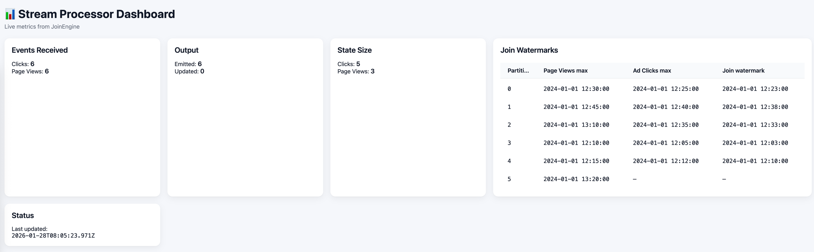
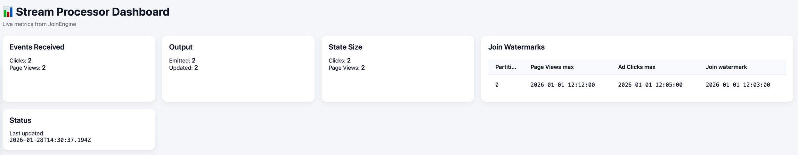

# Toyota Camry Processor
I ended up implementing 'emit immediately, update later' mode. Please see my explanation and reasoning below.
## Watermark logic
Both input streams `ad_click` and `page_views` are partitioned by user_id. It means that: 
* all events for a given `user_id` go to the same Kafka partition

We also can say that a join for a given user happens within same partition number in both topics:
* `ad_clicks` partition N joins only with `page_views` partition N
* cross partition joins are not in scope here (at least that was not explicitly mentioned in the requirements)
* `ad_cliks` and `page_views` are independent streams, so it means they can progress independently
* each Kafka partition has its own independent watermark
### Watermark calculation
For each Kafka partition we track:
* max event time seen in `ad_clicks` partition
* max event time seen in `page_views` partition

For a given partition P, the effective watermark is defined like:
```
watermark(P) = min(maxEventTime(ad_clicks_P), maxEventTime(page_views_P)) - allowed_lateness
```
We use minimum for watermarking here as we only consider event-time T complete once both streams have progressed past T.
We need to be sure that all relevant events for the join have arrived. 

### How watermarks are used
* Detect late events
* We finalize state: in case we use `update` mode - we know that page_views can no longer be updated
* Evict old state: clicks older than `watermark - attributionWindow` can be removed
* Attribution window limits which clicks are eligible, and watermark limits how long we wait for these clicks

## Write Semantics
In the assignment it was mentioned about the ability to use both strategies: 
* emit-on-watermark
* emit immediately, update Later

This implementation uses `emit immediately, update later`:
* when a `page_view` event is processed, it is attributed with any click which is available and stored in the output
* if there is an `ad_click` event arrives, it improves attribution for an already-emitted page view, and performs updates
* Once the watermark passes the page view's event time - page view is considered final, and no further updates are applied

System provides `at-least-once` delivery guarantees: 
* Kafka offsets are committed after successful processing
* On failure: events may be reprocessed, duplicate outputs are possible

### Why this particular option `emit immediately, update later` is chosen? What are advantages/disadvantages?
Both options are actually fine, but I think they are targeted for different real-world use cases. 
For example I would use `emit immediately` if I was working with a real time dashboard where low latency is important and I need to see the results quickly, 
while in `emit-on-watermark` this is more for targets/sinks which do not support updates and when we only care about final result: writing data to S3.
#### `Emit immediately` advantages:
* Low latency - we see the results as they arrive
* Better for real time

#### `Emit immediately` disadvantages:
* Multiple updates in the sink, so need to guarantee deduplication and idempotency
* More state to manage - we need also to 'remember' page_views 

#### `Emit-on-watermark` advantages:
* One final result - if this is a requirement
* No updates or correction so less pressure on target output system

#### `Emit-on-watermark` disadvantages:
* Higher latency, because we delay the output
* Not good for real-time use cases, usually users prefer to see something now even if it is supposed to be corrected later

## Concurrency model
### Worker threads/Tasks
* Each kafka topic is consumed by a Spring Kafka listener container configured to run with concurrency N
* Spring kafka creates up to N consumer threads per listener container
* Kafka guarantees in-order delivery within a partition, and Spring Kafka processes records for a given partition sequentially within a single consumer group

### Join-locality by Partition
* all events for user_id = 'A' land in partition p in both topics (assuming identical partitioning strategy and partition count)
* joins happen within partition p only
* there is no cross-partition coordination

### Shared state and Locking
Processor maintain in-memory state for:
* recent clicks (ClickStateStore)
* emitted page views which wait for possible updates (EmittedPageViewStore)
* per-partition watermark progress

Because listeners for both streams run concurrently, state must be thread-safe. 

#### WatermarkTracker
* Uses `ConcurrentHashMap` to store state
* Updates using atomic `merge` operation

#### ClickStateStore (per-user locking)
* uses `ConcurrentHashMap<userId, TreeSet>`
* each user click is stored in a TreeSet sorted by event time
* TreeSet is not thread safe but it synchronizes on the per-user set object

#### EmittedPageViewStore (per-page-view locking)
* uses `ConcurrentHashMap<userId, PageViewState>`
* for late click updates each `PageViewState` is synchronized independently during update checks

## Capacity planning and scaling
### Kafka Partitions
Throughput scales primarily with the number of Kafka partitions.
* Each partition can be processed independently
* Each partition can be assigned to a dedicated consumer thread
* Increasing partition count increases parallelism without changing application logic

### Consumer threads
We have a concurrency value of 3 configured - one thread processed one partition at a time

### State size
Processor maintains in-memory state for: ClickState, PageViewState
Watermarks ensure that state does not grow unbounded even under out-of-order arrival.

### Horizontal scaling
Multiple instances of the processor can be run in parallel:
* All instances share the same Kafka consumer group
* Kafka assigns partitions dynamically across instances
* Each partition is processed by exactly one instance at a time
* There is no shared mutable state across instances


## Tests
- Out-of-order events  - see `scenarios.TestOutOfOrderEvents` in test folder
- Late data - see `scenarios.TestLateData` in test folder
- Restart with committed offsets - see `scenarios.TestRestartCommittedOffsets` in test folder
- Concurrent partitions - - see `scenarios.TestConcurrentPartitions` in test folder
- There are also other tests per each package with more scenarios

## Potential risks and limitations
- Output delivery: at-least-once
- Join state: in memory, thats why after restart - late updates are not guaranteed
 

## Setup instructions
```
 docker compose up -d zookeeper kafka kafka-ui
 docker compose up -d --build dev   
```

Login to dev container
```
docker exec -it toyota_camry-dev-1 bash
```

Run data generator
```
To create a virtual env: 
python -m venv venv

source venv/bin/activate
pip install -r requirements.txt

python data_generator.py
```

Run main application
```
mvn spring-boot:run
```

Check that page_views are stored:
```
sqlite3 output/attributed_page_views.db

select count(*) from attributed_page_views;
6

select page_view_id, user_id, event_time, attributed_campaign_id, attributed_click_id from attributed_page_views;

```
You should see expected output that was produced by `data_generator` above: 

```
sqlite> select page_view_id, user_id, event_time, attributed_campaign_id, attributed_click_id from attributed_page_views order by page_view_id;
pv_1|user_1|2024-01-01T12:10:00Z|campaign_A|click_1
pv_2|user_2|2024-01-01T12:15:00Z|campaign_B|click_2
pv_3|user_3|2024-01-01T12:30:00Z|campaign_D|click_3b
pv_4|user_4|2024-01-01T13:10:00Z||
pv_5|user_5|2024-01-01T12:45:00Z|campaign_F|click_5
pv_6|user_6|2024-01-01T13:20:00Z||
```

## UI for testing
For testing purposes I built simple UI relying on package 'spring-boot-starter-web'. 
After starting your app - if you want to use UI - you can go to: 'http://localhost:8081'. It is useful to go through scenarios
and then see how number of clicks and page_views changes per partition, especially if testing across multiple partitions is required: 
To increase number of partitions for testing one could login to confluent kafka image 'confluentinc/cp-kafka:7.5.0' like the following: 
```
docker ps

CONTAINER ID   IMAGE                             COMMAND                  CREATED       STATUS                 PORTS                                            NAMES
ccb8d880025c   provectuslabs/kafka-ui:latest     "/bin/sh -c 'java --…"   5 hours ago   Up 5 hours             0.0.0.0:8080->8080/tcp                           kafka-ui
5aa021463c3f   toyota_camry-dev                  "sleep infinity"      
58a7eea2588c   confluentinc/cp-kafka:7.5.0       "/etc/confluent/dock…"   5 hours ago  

# and now we extend number of partitions to 6 assuming that in our scenario we will have 6 user_id
docker exec -it 58a7eea2588c bash
kafka-topics   --bootstrap-server localhost:9092   --alter   --topic ad_clicks   --partitions 6
kafka-topics   --bootstrap-server localhost:9092   --alter   --topic page_views   --partitions 6

python data_generator.py

```


There are also a couple of scenarios under `scenarios` folder to check basic flows and monitor metrics: 
``` 
python scenarios/custom_data_generator.py --scenario metrics_reference
```



